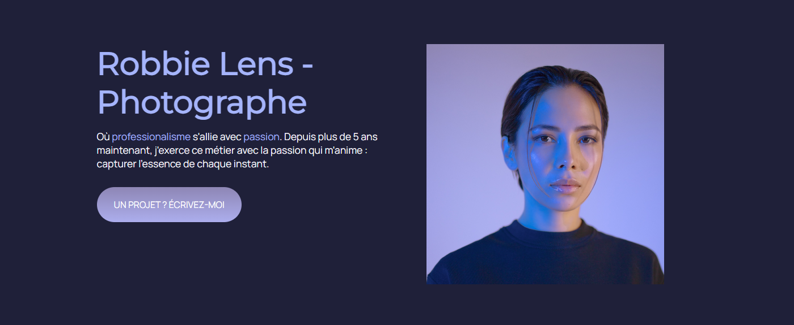

# :chess_pawn: Robbie Lens - Photographe #

Ce projet à été réalisé dans le cadre d'une formation sur <a href = 'https://openclassrooms.com/fr/courses/1603881-creez-votre-site-web-avec-html5-et-css3' target = '_blank'>OpenClassRoom</a> afin d'apprendre les bases du HTML et du CSS.

## Fonctionnalités ##

- **Galerie de Photos :** Explorez les œuvres photographiques de l'artiste avec différent effets.
- **Design Minimaliste :** Une mise en page simple et épuré pour mettre en valeur le portfolio.
- **Responsive :** Compatible avec différents appareils pour une expérience utilisateur optimale.
- **Personnalisation :** Un favicon a été ajouté ainsi qu'une personnalisation du footer.

### Technologies Utilisées ###

#### Mon Projet ####

Ce projet fut le premier réalisé sur OpenClassroom. Il m'a permis de revoir & apprendre les bases en HTML & CSS. J'ai laisser cours a ma fantasie pour le personnalisé sans le dénaturé.

##### Comment Exécuter le Projet Localement #####

Clonez ce référentiel sur votre machine locale.

